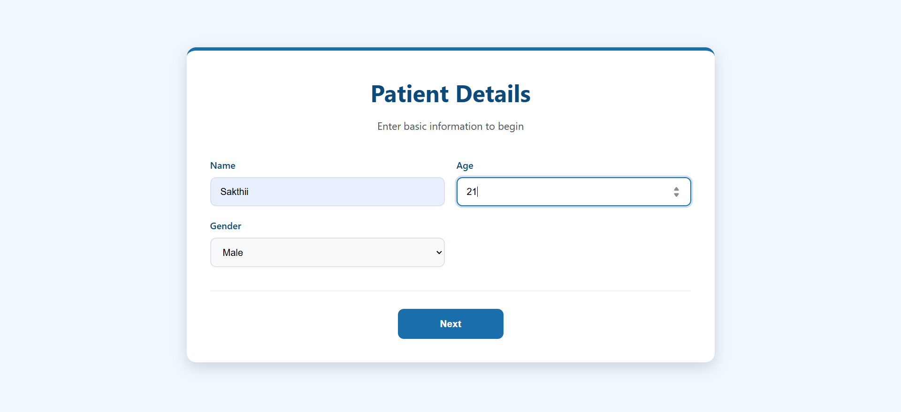
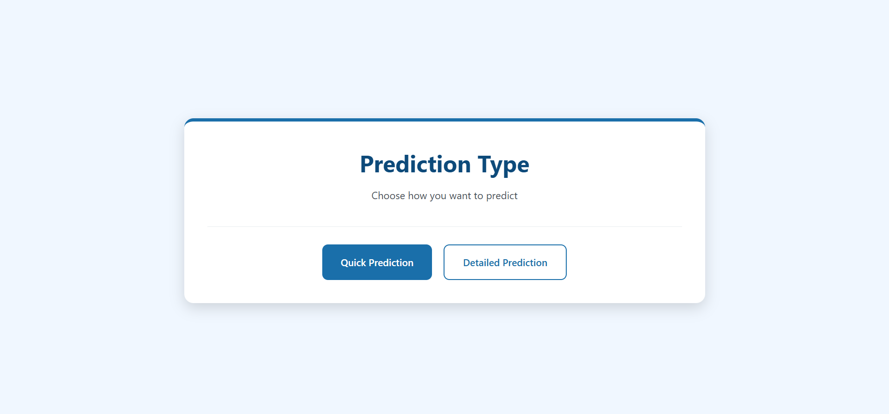
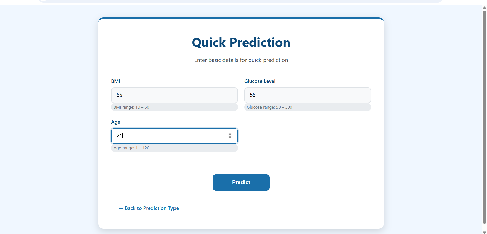
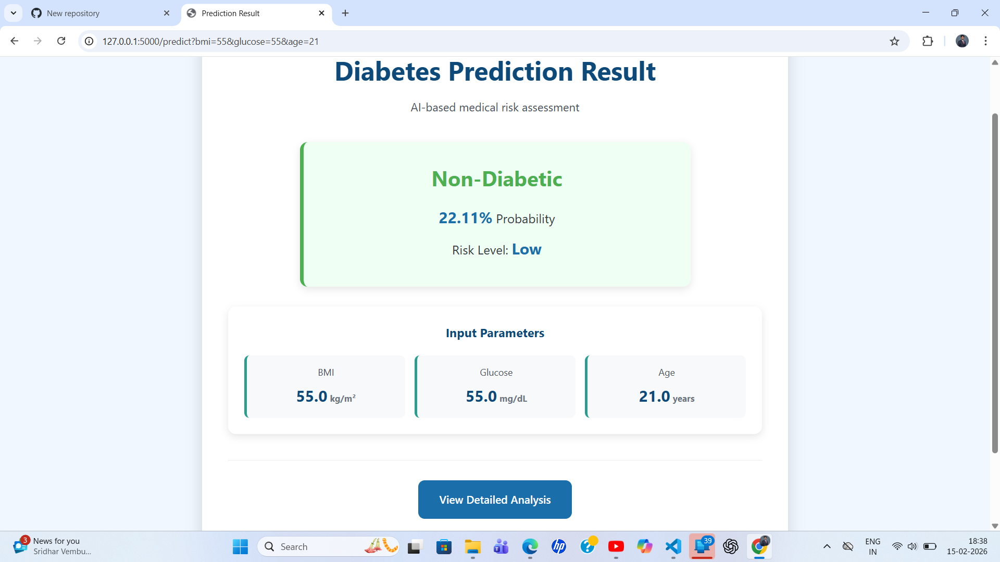
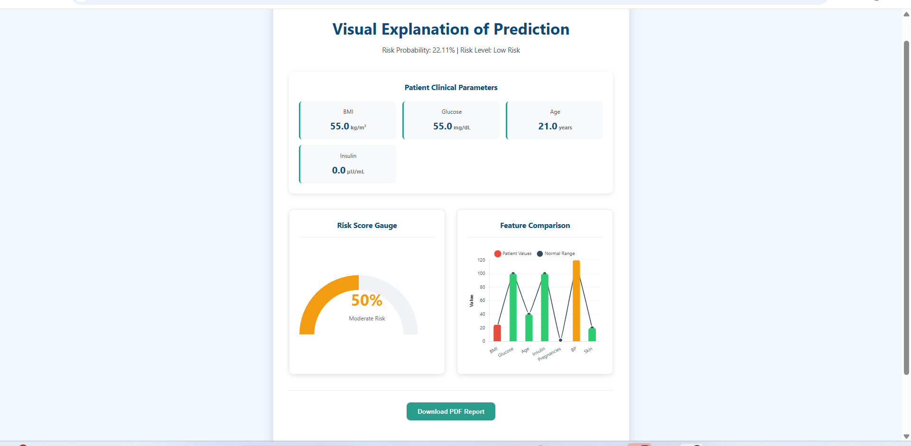

# 🩺 Diabetes Prediction Web Application

An end-to-end Machine Learning powered web application designed to predict diabetes risk using clinical health parameters. This project integrates data preprocessing, model training, and Flask-based deployment to deliver real-time predictions through a structured and user-friendly interface.

---

## 📌 Overview

Diabetes is a chronic medical condition that requires early identification for effective management. This system leverages supervised Machine Learning algorithms trained on the PIMA Indian Diabetes Dataset to classify whether a patient is at risk of diabetes based on key health indicators.

The application supports both quick prediction and detailed prediction modes, enabling flexible user interaction and improved usability.

---

## 🎯 Core Features

- Real-time diabetes risk prediction  
- Dual prediction modes (Quick & Detailed)  
- Flask backend integration with trained ML models  
- Clean multi-page web interface  
- Structured project architecture  
- Interactive result display  

---

## 🧠 Machine Learning Workflow

1. Data Cleaning and Preprocessing  
2. Feature Engineering  
3. Model Training and Evaluation  
4. Model Serialization using Joblib  
5. Backend Deployment using Flask  
6. Real-Time Prediction Rendering  

---

## 🛠 Tech Stack

Backend: Python, Flask, Scikit-Learn, NumPy, Pandas, Joblib  
Frontend: HTML5, CSS3, JavaScript  
Visualization: Charts.js  

---

## 🏗 Application Architecture

User Input → Data Preprocessing → ML Model Prediction → Flask Backend → Result Display

---

## 📂 Project Structure

DIABETES_APP/
│
├── models/
├── static/
├── templates/
├── assets/
├── app.py
├── requirements.txt
└── README.md

yaml
Copy code

---

## 📊 Screenshots

### Home Page

### Prediction Type Selection

### Quick Prediction Input

### Quick Prediction Result

### Detailed Prediction Result

---

## 🚀 How to Run Locally

Clone the repository:

git clone https://github.com/yourusername/diabetes-prediction-ml-flask.git

css
Copy code

Navigate to the project folder:

cd diabetes-prediction-ml-flask

yaml
Copy code

Install dependencies:

pip install -r requirements.txt

yaml
Copy code

Run the application:

python app.py

r
Copy code

Open in browser:

http://127.0.0.1:5000/

yaml
Copy code

---

## 📈 Key Highlights

- End-to-End Machine Learning Deployment  
- Production-style Flask Integration  
- Modular Code Structure  
- Real-Time Health Risk Assessment  
- Portfolio-Ready Implementation  

---

## 🔮 Future Enhancements

- Cloud Deployment (Render / AWS)  
- REST API Version  
- User Authentication System  
- Model Optimization and Hyperparameter Tuning  

---

## 👨‍💻 Author

Sakthi Kumar  
Data Analyst | ML Engineer  
GitHub: https://github.com/sakthikumar-1
